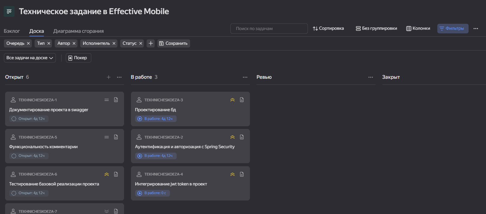
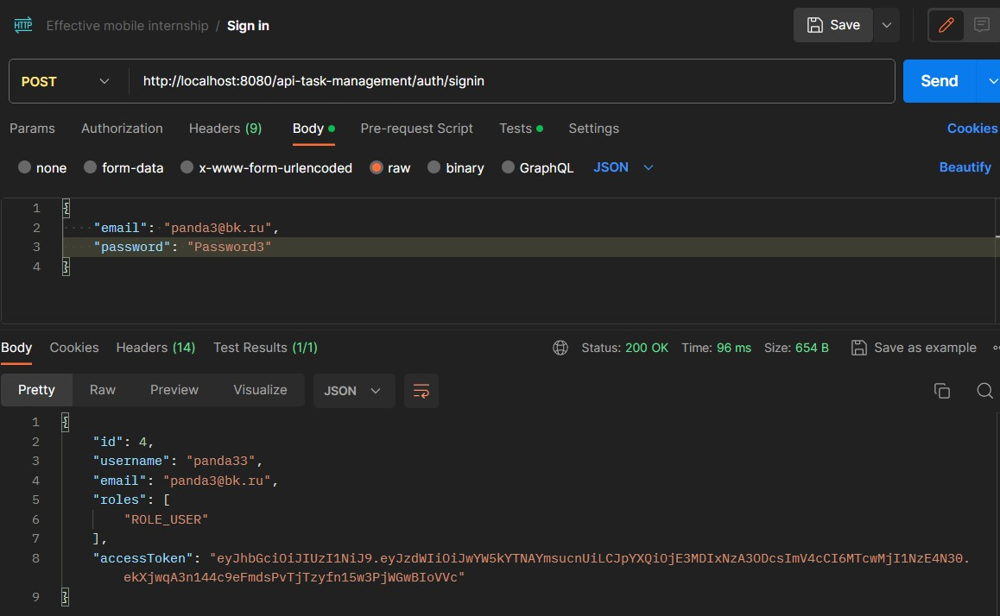
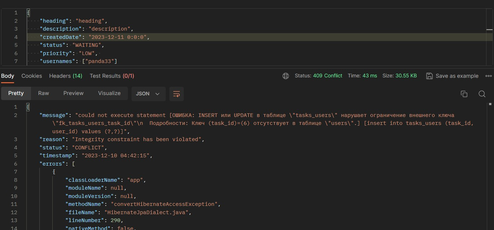
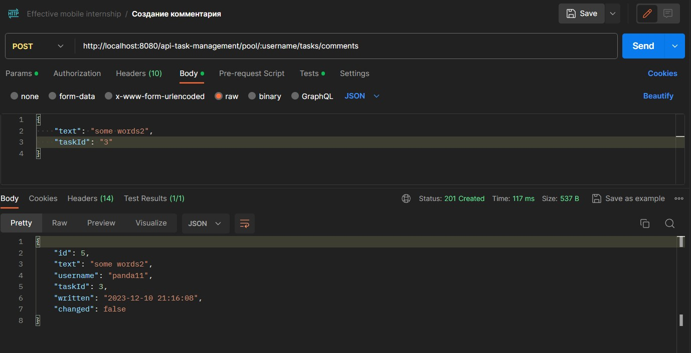

# Task Management API

Изначально я составил план для проектирования api на scrum доске

## Процесс авторизации и регистрации
На диаграмме показан процесс того, как я реализую регистрацию пользователя и авторизацию.

## Jwt token
Также была реализована аутентификация с помощью jwt token

## Тестирование api
Первоначально api было протестировано в postman, ниже представлены основные методы и их вывод

Регистрация пользователя

Авторизация пользователя

Данные в бд

Создание задачи

Ошибка (все ошибки были представлены в виде ApiError, а exceptions описаны в ErrorHandler)
<pre>
  <code>
@ToString
@Getter
@Builder
public class ApiError {

    // Класс для понятного вывода ошибок

    @JsonInclude(JsonInclude.Include.NON_NULL)
    private String message;
    private String reason;
    private String status;
    @JsonFormat(shape = JsonFormat.Shape.STRING, pattern = "yyyy-MM-dd HH:mm:ss")
    private LocalDateTime timestamp;
    private StackTraceElement[] errors;
}

  </code>
</pre>

Обновление задачи

Создание комментария
## Документирование
Api было задокументировано с помощью spring boot 3 swagger
## Планы для развития api
В дальнейшем можно добавить новые возможности админу приложения, для удаления пользователей и установления роли пользователю "только для чтения"
Также можно добавить рейтинг активности пользователей, чтобы просматривать кто и сколько создает/реализовывает задачи
## Что я не успел сделать
К сожалению, я не успел написать тесты для базовой реализации api.
Поэтому решил оставить ссылку на свой проект java-shareit https://github.com/DDDimbo/java-shareit, где показаны мои навыки в написании тестов.
